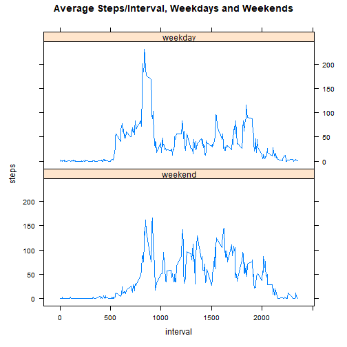
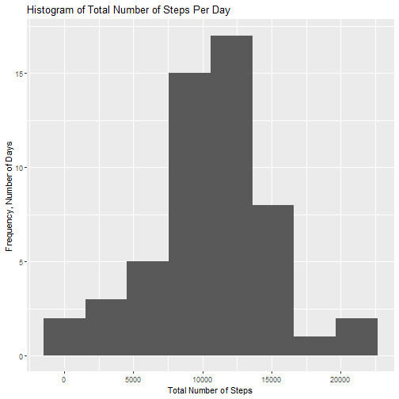
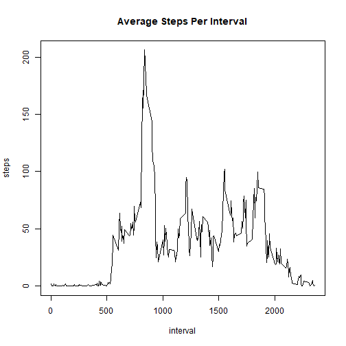

Reproducible Research Project 1 - Elizabeth Lundeen
=============================

**Step 1: Code for reading in the data set and/or processing the data (exploring the data).**


```r
setwd("C:/Users/yxj4/OneDrive - CDC/+My_Documents/CDC/1 DDT/Data Modernization/Coursera/Hopkins Data Science Specialization/5 Reproducible Research/3 Course Project 1")
activity <- read.csv("activity.csv")
head(activity,10)
```

```
##    steps       date interval
## 1     NA 2012-10-01        0
## 2     NA 2012-10-01        5
## 3     NA 2012-10-01       10
## 4     NA 2012-10-01       15
## 5     NA 2012-10-01       20
## 6     NA 2012-10-01       25
## 7     NA 2012-10-01       30
## 8     NA 2012-10-01       35
## 9     NA 2012-10-01       40
## 10    NA 2012-10-01       45
```

```r
str(activity)
```

```
## 'data.frame':	17568 obs. of  3 variables:
##  $ steps   : int  NA NA NA NA NA NA NA NA NA NA ...
##  $ date    : chr  "2012-10-01" "2012-10-01" "2012-10-01" "2012-10-01" ...
##  $ interval: int  0 5 10 15 20 25 30 35 40 45 ...
```

**Step 2: Show the distribution of total number of steps per day and calculate the mean and median total number of steps per day.**

* Calculate the total number of steps taken per day.    
* Make a histogram of the total number of steps taken each day.  
* Calculate and report the mean and median of the total number of steps taken per day.  

Answer: the mean number of steps per day is 10,766.19 and the median number of steps per day is 10,765.


```r
library(ggplot2)
activity$date <- as.Date(activity$date)
totalsteps <- aggregate(steps ~ date, activity, sum)
qplot(steps, data = totalsteps, bins=8, xlab = "Total Number of Steps", ylab = "Frequency, Number of Days", main = "Histogram of Total Number of Steps Per Day")
```



```r
meansteps <- mean(totalsteps$steps, na.rm=TRUE)
mediansteps <- median(totalsteps$steps, na.rm=TRUE)

meansteps
```

```
## [1] 10766.19
```

```r
mediansteps
```

```
## [1] 10765
```

**Step 3: Time Series Plot to Show the Average Daily Activity Pattern Per 5-Minute Interval**

* Make a time series plot (type = "l") of the 5-minute interval (x-axis) and the average number of steps taken, averaged across all days (y-axis).  
* Which 5-minute interval, on average across all the days in the dataset, contains the maximum number of steps?  

Answer: Interval 835 contains the maximum number of steps (206.1698 steps)


```r
intervalsteps <- aggregate(steps ~ interval, data = activity, mean)
str(intervalsteps)
```

```
## 'data.frame':	288 obs. of  2 variables:
##  $ interval: int  0 5 10 15 20 25 30 35 40 45 ...
##  $ steps   : num  1.717 0.3396 0.1321 0.1509 0.0755 ...
```

```r
plot(intervalsteps,type="l", main = "Average Steps Per Interval")
```


```r
intervalsteps[which.max(intervalsteps$steps),]
```

```
##     interval    steps
## 104      835 206.1698
```

**Step 4: Imputing Missing Values**
* Calculate and report the total number of missing values in the data set (i.e. the total number of rows with NAs).    
* Impute the missing values in the dataset by using the mean for that 5-minute interval.  
* Create a new data set that is equal to the original data set but with the missing data filled in.  
* Make a histogram of the total number of steps taken each day.    
* Calculate and report the mean and median total number of steps taken per day.  
* Do these values differ from the estimates from the first part of the assignment?   
* What is the impact of imputing missing data on the estimates of the total daily number of steps?  

Answer:  
* Total number of missing values in the data set (steps variable): 2304  
* Mean total number of steps taken per day: 10766.19  
* Median total number of steps taken per day: 10765   
* The mean and median don't differ from the first part of the assignment however the total daily number of steps is larger.  


```r
sum(is.na(activity$steps))
```

```
## [1] 2304
```

```r
activity2 <- activity
miss <- is.na(activity2$steps)
avg_interval <- tapply(activity2$steps, activity2$interval, mean, na.rm=TRUE, simplify=TRUE)
activity2$steps[miss] <- avg_interval[as.character(activity2$interval[miss])]

sum(is.na(activity2$steps))
```

```
## [1] 0
```

```r
activity2$date <- as.Date(activity2$date)
totalsteps2 <- aggregate(steps ~ date, activity2, sum)
qplot(steps, data = totalsteps2, bins=11, xlab = "Total Number of Steps", ylab = "Frequency, Number of Days", main = "Histogram of Total Number of Steps Per Day (No NAs)")
```



```r
meansteps2 <- mean(totalsteps2$steps, na.rm=TRUE)
mediansteps2 <- median(totalsteps2$steps, na.rm=TRUE)

meansteps
```

```
## [1] 10766.19
```

```r
mediansteps
```

```
## [1] 10765
```

**Step 5: Determine if there are differences in activity patterns between weekdays and weekends**


```r
library(lattice)
week_days <- c('Monday', 'Tuesday', 'Wednesday', 'Thursday', 'Friday')
activity2$dayofweek <- factor((weekdays(activity2$date) %in% week_days), levels=c(FALSE, TRUE), labels=c('weekend', 'weekday'))
table(activity2$dayofweek)
```

```
## 
## weekend weekday 
##    4608   12960
```

```r
averagesteps <- aggregate(steps ~ interval+dayofweek, data = activity2, mean)
str(averagesteps)
```

```
## 'data.frame':	576 obs. of  3 variables:
##  $ interval : int  0 5 10 15 20 25 30 35 40 45 ...
##  $ dayofweek: Factor w/ 2 levels "weekend","weekday": 1 1 1 1 1 1 1 1 1 1 ...
##  $ steps    : num  0.21462 0.04245 0.01651 0.01887 0.00943 ...
```

```r
xyplot(steps ~ interval | dayofweek, data = averagesteps, type="l", layout = c(1, 2), main = "Average Steps/Interval, Weekdays and Weekends")
```



